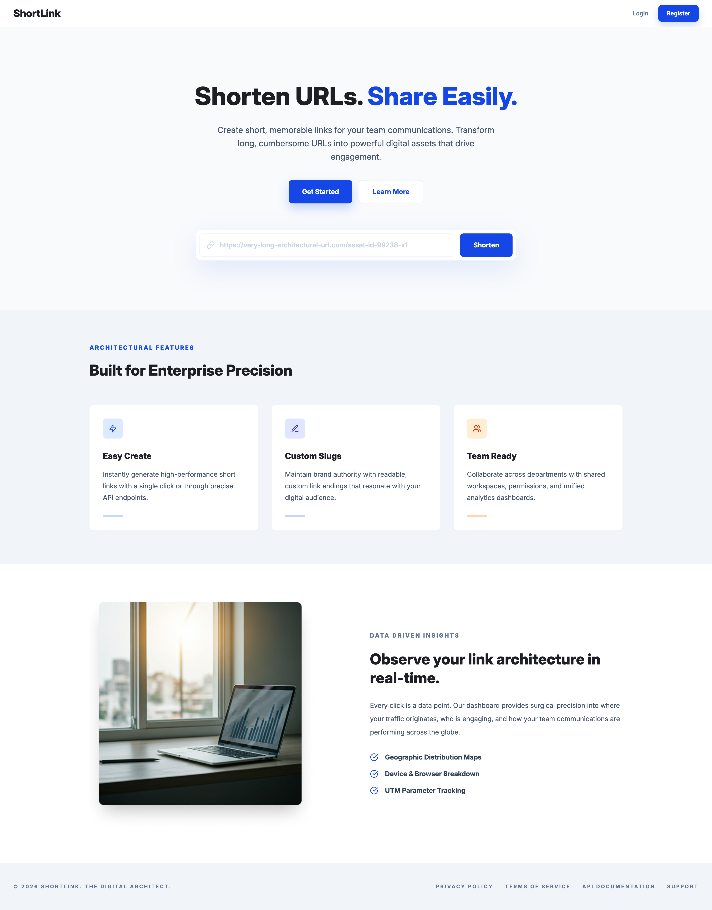
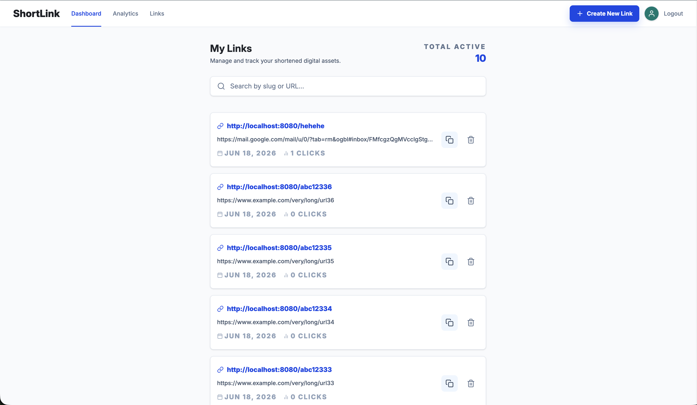

# ShortLink Frontend

ShortLink is a URL shortener frontend built with React and Vite. It provides a public landing page, authentication screens, and a protected dashboard for creating, searching, copying, and deleting shortened links.

## Preview

### Landing Page



### Dashboard



## Technology Stack


## Features

- Responsive landing page for the ShortLink product.
- User registration and login flow.
- Protected dashboard for authenticated users.
- Create short links with optional custom slugs.
- Search shortened links by slug or URL.
- Copy short links to clipboard.
- Delete links with confirmation dialog.
- Paginated link list with total active link count.
- Profile page with session logout.
- Toast notifications and form validation feedback.

## Prerequisites

Before running this project locally, make sure you have:

- [Node.js](https://nodejs.org/) installed.
- [npm](https://www.npmjs.com/) installed.
- [Git](https://git-scm.com/) installed.
- ShortLink backend running locally or available through an API URL.

## Setup Instruction

Clone the repository:

```bash
git clone https://github.com/anggavb/shortlink-frontend.git
cd shortlink-frontend
```

Install dependencies:

```bash
npm install
```

Create a local environment file:

```bash
cp .env.example .env
```

Configure the API base URL in `.env`:

```env
VITE_ENV=development
VITE_APP_TITLE="ShortLink"
VITE_API_BASE_URL=http://localhost:8080
```

Run the development server:

```bash
npm run dev
```

Useful scripts:

```bash
npm run build
npm run preview
npm run lint
```

## Project Structure

```text
.
├── public/
│   ├── dashboard.png
│   ├── landing.png
│   └── favicon.svg
├── src/
│   ├── components/
│   │   ├── admin/
│   │   ├── auth/
│   │   ├── landing/
│   │   ├── layout/
│   │   └── ui/
│   ├── pages/
│   │   ├── admin/
│   │   ├── auth/
│   │   ├── LandingPage.jsx
│   │   └── NotFoundPage.jsx
│   ├── redux/
│   │   ├── auth/
│   │   ├── links/
│   │   └── store.js
│   ├── utils/
│   ├── AppRouter.jsx
│   ├── main.jsx
│   └── tailwind.css
├── .env.example
├── eslint.config.js
├── package.json
└── vite.config.js
```

## How to Contribute

1. Fork this repository.
2. Create a new branch:

   ```bash
   git checkout -b feature/your-feature-name
   ```

3. Make your changes.
4. Run linting before submitting:

   ```bash
   npm run lint
   ```

5. Commit your changes:

   ```bash
   git commit -m "Add your feature"
   ```

6. Push your branch and open a pull request.

## Related Project

- [ShortLink Backend](https://github.com/anggavb/shortlink-backend)

## License

This project is licensed under the [MIT License](./LICENSE).
